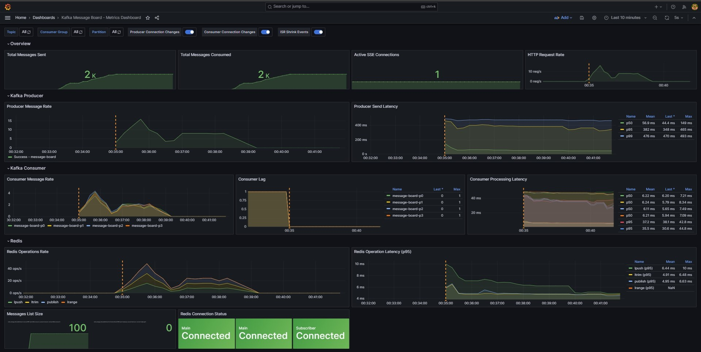
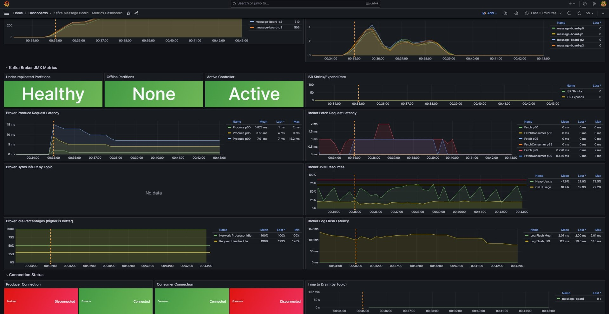
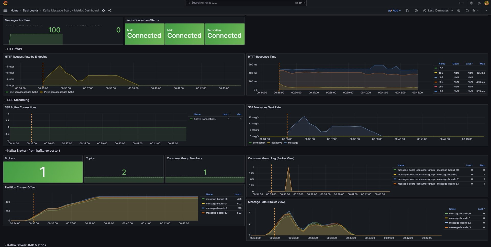

# Kafka Monitoring Demo

A demonstration project showing how to integrate **Prometheus** and **Grafana** monitoring with **Apache Kafka**. Uses a simple message board application as the workload.

## What This Project Demonstrates

- **Application-level metrics** using prom-client (producer/consumer latency, throughput, errors)
- **Broker-level metrics** using kafka-exporter (partition lag, offsets, consumer groups)
- **Deep JMX metrics** using jmx-exporter (ISR, request latency, JVM stats)
- **Production-ready alerting** with intelligent thresholds (velocity-based, not absolute)
- **Pre-built Grafana dashboards** with 30+ panels across 8 sections

## Quick Start

```bash
# 1. Install dependencies
npm install

# 2. Start infrastructure (Kafka, Redis, Prometheus, Grafana)
npm run docker:up

# 3. Start consumer (in new terminal)
npm run kafka:consumer

# 4. Start web app (in new terminal)
npm run dev
```

## Access Points

| Service | URL | Purpose |
|---------|-----|---------|
| **Grafana** | http://localhost:3001 | Dashboards (admin/admin) |
| **Prometheus** | http://localhost:9090 | Metrics & alerts |
| **Message Board** | http://localhost:3000 | Generate traffic |
| **Kafka UI** | http://localhost:8080 | Inspect topics |
| **Redis** | localhost:6379 | Message storage & Pub/Sub |

## Monitoring Architecture

```
┌─────────────────────────────────────────────────────────────┐
│                      Data Flow                              │
├─────────────────────────────────────────────────────────────┤
│  Browser → Next.js API → Kafka → Consumer → Redis → SSE    │
│                                                             │
│  User posts message → Producer sends to Kafka topic         │
│  Consumer reads from Kafka → Stores in Redis Lists          │
│  Redis Pub/Sub → Pushes to SSE → Real-time browser update   │
└─────────────────────────────────────────────────────────────┘

┌─────────────────────────────────────────────────────────────┐
│                    Metrics Sources                          │
├─────────────────────────────────────────────────────────────┤
│  Next.js App (:3000/api/metrics)                            │
│    → Producer metrics, HTTP metrics, SSE metrics            │
│                                                             │
│  Consumer Process (:9xxx/metrics)                           │
│    → Consumer lag, processing duration, Redis metrics       │
│                                                             │
│  kafka-exporter (:9308)                                     │
│    → Partition offsets, consumer group lag, broker count    │
│                                                             │
│  jmx-exporter (:5556)                                       │
│    → ISR shrinks, request latency, JVM heap, idle %         │
└─────────────────────────────────────────────────────────────┘
                              ↓
┌─────────────────────────────────────────────────────────────┐
│                    Prometheus (:9090)                       │
│  • Scrapes all metric endpoints                             │
│  • Evaluates alert rules                                    │
│  • Stores time-series data                                  │
└─────────────────────────────────────────────────────────────┘
                              ↓
┌─────────────────────────────────────────────────────────────┐
│                     Grafana (:3001)                         │
│  • Pre-built dashboards with filtering by topic/partition   │
│  • Connection status indicators                             │
│  • Alert visualization                                      │
└─────────────────────────────────────────────────────────────┘
```

## Metrics Overview

### Application Metrics (prom-client)

| Metric | Description |
|--------|-------------|
| `kafka_producer_messages_sent_total` | Messages sent (success/error) |
| `kafka_producer_send_duration_seconds` | Producer latency histogram |
| `kafka_consumer_messages_consumed_total` | Messages consumed per partition |
| `kafka_consumer_lag` | Consumer lag (message count) |
| `kafka_consumer_lag_seconds` | Consumer lag (time-based) |

### Broker Metrics (kafka-exporter)

| Metric | Description |
|--------|-------------|
| `kafka_brokers` | Number of brokers in cluster |
| `kafka_topic_partition_current_offset` | Current offset per partition |
| `kafka_consumergroup_lag` | Lag from broker's perspective |
| `kafka_consumergroup_members` | Active consumers in group |

### JMX Metrics (jmx-exporter)

| Metric | Description |
|--------|-------------|
| `kafka_server_replicamanager_underreplicatedpartitions` | Under-replicated partitions |
| `kafka_controller_kafkacontroller_offlinepartitionscount` | Offline partitions |
| `kafka_network_requestmetrics_totaltime_ms_p99` | Request latency percentiles |
| `kafka_jvm_heap_memory_used_bytes` | JVM memory usage |

### Redis Metrics (prom-client)

| Metric | Description |
|--------|-------------|
| `redis_operations_total` | Operations by type (get, set, lpush, publish) |
| `redis_operation_duration_seconds` | Operation latency histogram |
| `redis_connection_status` | Connection health (1=connected, 0=disconnected) |
| `redis_messages_list_size` | Number of messages stored in Redis |

## Alert Rules

Alerts use **intelligent thresholds** - velocity-based rather than absolute values.

| Alert | Condition | Why It's Better |
|-------|-----------|-----------------|
| `KafkaConsumerLagGrowing` | `deriv(lag) > 10` | Detects trend, not just high numbers |
| `KafkaHighTimeToDrain` | `lag / consume_rate > 5m` | Human-meaningful threshold |
| `KafkaConsumerThroughputDrop` | `current < 50% of hourly avg` | Relative to baseline |
| `KafkaISRShrinking` | `rate(isr_shrinks) > 0` | Early warning of broker issues |

## Grafana Dashboard Sections

1. **Overview** - Message totals, SSE connections, request rate
2. **Kafka Producer** - Send rate, latency percentiles
3. **Kafka Consumer** - Consume rate, lag (count & seconds), processing time
4. **Redis** - Operations, latency, connection status
5. **HTTP/API** - Request rate by endpoint, response times
6. **SSE Streaming** - Active connections, message rate
7. **Kafka Broker** - Broker count, partition offsets, consumer group lag
8. **Kafka JMX** - ISR, request latency, JVM resources, idle percentages

## Dashboard Screenshots

### Overview Panel









## Load Testing

Generate traffic to see metrics in action:

```bash
# Send 1000 messages in batches of 100
for batch in {1..10}; do
  for i in {1..100}; do
    curl -s -X POST http://localhost:3000/api/messages \
      -H "Content-Type: application/json" \
      -d "{\"author\":\"LoadTest\",\"content\":\"Message $i\"}" &
  done
  wait
  sleep 3
done
```

## Key Files

```
monitoring/
├── prometheus/
│   ├── prometheus.yml          # Scrape configs for all exporters
│   ├── alerts.yml              # 40+ production-ready alert rules
│   └── jmx-exporter-config.yml # JMX metrics configuration
└── grafana/
    └── provisioning/
        ├── datasources/        # Auto-configured Prometheus
        └── dashboards/         # Pre-built dashboard (30+ panels)

src/lib/metrics/
├── kafka-metrics.ts    # Producer/consumer metrics
├── redis-metrics.ts    # Redis operation metrics
├── http-metrics.ts     # HTTP request metrics
└── sse-metrics.ts      # SSE connection metrics
```

## Why Both App Metrics and Exporters?

| Source | What It Sees | Use Case |
|--------|--------------|----------|
| **App metrics** | Client-side latency, errors | Application performance |
| **kafka-exporter** | Broker state, offsets | Cluster health |
| **jmx-exporter** | Internal broker metrics | Deep diagnostics |

Example: Broker shows `lag = 0`, but app shows `lag_seconds = 30s`. Consumer is keeping up with offsets but processing is slow.

## Redis in This Architecture

Redis serves two purposes in this application:

| Purpose | How It Works |
|---------|--------------|
| **Message Storage** | Messages consumed from Kafka are stored in Redis Lists for quick retrieval |
| **Real-time Updates** | Redis Pub/Sub pushes new messages to SSE clients instantly |

This creates a flow: `Kafka → Consumer → Redis → SSE → Browser`

## Technology Stack

- **App**: Next.js 15, TypeScript, KafkaJS, ioredis
- **Infrastructure**: Kafka (KRaft), Redis, Docker Compose
- **Monitoring**: Prometheus, Grafana, kafka-exporter, jmx-exporter, prom-client

## Resources

- [Prometheus Documentation](https://prometheus.io/docs/)
- [Grafana Documentation](https://grafana.com/docs/)
- [kafka-exporter](https://github.com/danielqsj/kafka_exporter)
- [prom-client](https://github.com/siimon/prom-client)

## License

MIT
